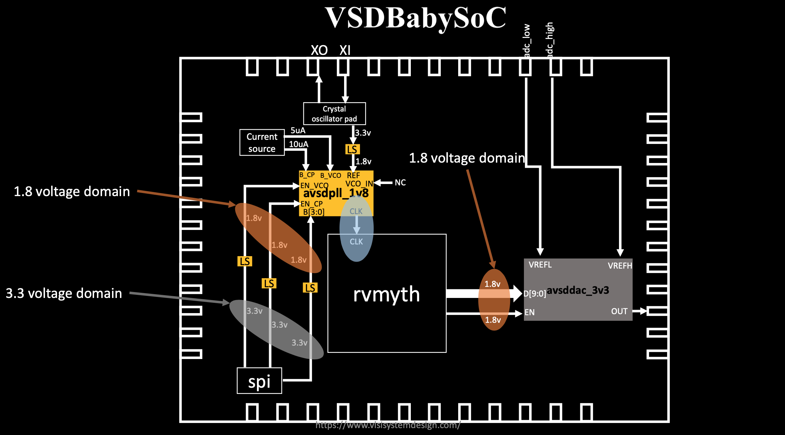

## Table of Contents

- [Part 1: SoC (Theory)](#part-1-soc-theory)
- [Part 2: BabySoC Fundamentals & Functional Modelling](#part-2--babysoc-fundamentals--functional-modelling) 

## Part 1: SoC (Theory)

### What is Soc?

A System on a Chip (SoC) is like a small computer made on a single chip. All the functions are combined into 1 single chip instead of multiple chips. This makes Soc more power and space efficient . SoC are present on smartphones, smartwatches etc.

#### Key Parts of an SoC:

1. **CPU** : The brain of the SoC. It does most of the processing and handles all the instructions given to it.

2. **Memory** : 
   
   - **RAM** for temporary storage of data before you shutdown the device.
   
   - **ROM** for the storage of data even after the device is shutdown.

3- **Graphics Processing Unit (GPU)** Handles the visual and graphics processing.

4- **I/O Ports** used to connect to external device like cameras, USB.

5- **Digital Signal Processor**: Processes audio and video signal.

6- **Power Management** Regulates power usage in the SoC improving its efficiency.

7- **Special Features** : Additional modules like the Wi-Fi, Bluetooth, GPS etc. 

In BabySoC, key peripherals include:

- **Phase-Locked Loop (PLL)** for stable clock generation.
- **10-bit Digital-to-Analog Converter (DAC)** for analog signal output.

### Why BabySoC ?

**BabySoC** is a simplified, educational SoC model built using open-source IPs. It integrates:

- **RVMYTH RISC-V CPU** for digital processing,
- **PLL** for precise clock synchronization, and
- **DAC** for bridging the digital-to-analog world.

By keeping the design compact and focusing on a few essential components, BabySoC makes it easier to:

- Learn **how CPUs, clocks, and converters interact** within an SoC,
- Explore **digital-to-analog interfacing**, and
- Understand **timing, synchronization, and modular integration** without the overwhelming complexity of industrial SoCs.

**BabySoC** emphasizes **functional modeling** as the crucial first step. By experimenting with BabySoC’s behavior, learners grasp core SoC principles before tackling RTL coding or silicon-level challenges.



- **Energy Efficient**: Lower power consumption.
- **High Performance**: Faster data processing.
- **Cost Effective**: Cheaper to manufacture.
- **Reliable**: Fewer failure points.

#### Where You’ll Find SoCs

- Smartphones, tablets, wearables, IoT devices, cars, TVs.

#### Some Popular SoCs

- Apple A-Series, Qualcomm Snapdragon, Samsung Exynos, NVIDIA Tegra.

#### Challenges with SoCs

- Complex design, heat issues, less flexibility.

## The Role of Functional Modeling

Designing a real SoC goes through multiple stages:

1. **Functional Modeling**
   
   - High-level behavioral simulation of the SoC.
   - Ensures that the CPU, memory, PLL, and DAC interact correctly.
   - Helps in debugging logic early, before committing to hardware.

2. **RTL Design (Register Transfer Level)**
   
   - Hardware description in Verilog/VHDL.
   - Focuses on clock cycles, registers, and data paths.

3. **Physical Design**
   
   - Translating RTL into layouts, gates, and silicon fabrication details.


## Part 2 -BabySoC Fundamentals & Functional Modelling

### Setup:

The directory should look like this:

```
VSDBabySoC/
├── src/
│   ├── include/
│   │   ├── sandpiper.vh
│   │   └── other header files...
│   ├── module/
│   │   ├── vsdbabysoc.v      # Top-level module integrating all components
│   │   ├── rvmyth.v          # RISC-V core module
│   │   ├── avsdpll.v         # PLL module
│   │   ├── avsddac.v         # DAC module
│   │   └── testbench.v       # Testbench for simulation
└── output/
    ├──compiled_tlv/         # Holds compiled intermediate files if needed
```

### Module Description:

1. **vsdbabysoc.v** : This is the top-level module that integrates the rvmyth, pll, and dac modules.

2. **rvmyth.v** : The rvmyth module is a simple RISC-V based processor. It outputs a 10-bit digital signal (OUT) to be converted by the DAC.

3. **avsdpll.v** : The pll module is a phase-locked loop that generates a stable clock (CLK) for the RISC-V core.

4. **avsddac.v** : The dac module converts the 10-bit digital signal from the rvmyth core to an analog output.

## Simulation Steps:

### Pre-synthesis simulation:

```shell
cd VSDBabySoC
make pre_synth_sim
```

This generates the **rvmyth.v** file from the **rvmyth.tlv** file and stores it in compiled_tlv folder.

Also the result of the simulation (i.e. `pre_synth_sim.vcd`) will be stored in the `output/pre_synth_sim` directory.

To see the output run :

```shell
gtkwave output/pre_synth_sim/pre_synth_sim.vcd
```


In this picture we can see the following signals:

- **CLK:** This is the `input CLK` signal of the core. This signal comes from the PLL, originally.
- **reset:** This is the `input reset` signal of the core. This signal comes from an external source, originally.
- **OUT:** This is the `output OUT` signal that comes from the DAC (due to simulation restrictions it behaves like a digital signal).
- **RV_TO_DAC[9:0]:** This is the 10-bit `output [9:0] OUT` port of the core. This port comes from the RVMYTH register #17.
- **OUT:** This is a `real` datatype wire which can simulate analog values. It is the `output wire real OUT` signal of the `DAC` module. This signal comes from the DAC.

### Post-synthesis simulation:

To synthesize the run the following :

```shell
make synth
```

This command `make synth` uses yosys to perform the sythesis. After this command a netlist is created stored in `output/synth/vsdbabysoc.synth.v` file.

#### Gate level Simulation

```shell
cd VSDBabySoC
make pre_synth_sim
```

The result of the simulation (i.e. `post_synth_sim.vcd`) will be stored in the `output/post_synth_sim` directory.

To see the output run :

```shell
gtkwave output/post_synth_sim/post_synth_sim.vcd
```

In this picture we can see the following signals:


- **\core.CLK:** This is the `input CLK` signal of the core. This signal comes from the PLL, originally.
- **reset:** This is the `input reset` signal of the core. This signal comes from an external source, originally.
- **OUT:** This is the `output OUT` signal that comes from the DAC (due to simulation restrictions it behaves like a digital signal).
- **\core.OUT[9:0]:** This is the 10-bit `output [9:0] OUT` port of the core. This port comes from the RVMYTH register #17.
- **OUT:** This is a `real` datatype wire which can simulate analog values. It is the `output wire real OUT` signal of the `DAC` module. This signal comes from the DAC.

## Yosys Final Report:

#### [Link to the Log File](.//VSDBabySoC/output/synth/synth.log)

```shell
=== vsdbabysoc ===

   Number of wires:               4737
   Number of wire bits:           6211
   Number of public wires:        4737
   Number of public wire bits:    6211
   Number of memories:               0
   Number of memory bits:            0
   Number of processes:              0
   Number of cells:               5913
     avsddac                         1
     avsdpll                         1
     sky130_fd_sc_hd__a2111oi_0      5
     sky130_fd_sc_hd__a211oi_1      10
     sky130_fd_sc_hd__a21boi_0       4
     sky130_fd_sc_hd__a21o_2         3
     sky130_fd_sc_hd__a21oi_1      686
     sky130_fd_sc_hd__a221oi_1     168
     sky130_fd_sc_hd__a22o_2         4
     sky130_fd_sc_hd__a22oi_1      137
     sky130_fd_sc_hd__a311oi_1       4
     sky130_fd_sc_hd__a31o_2         1
     sky130_fd_sc_hd__a31oi_1      315
     sky130_fd_sc_hd__a32oi_1        1
     sky130_fd_sc_hd__a41oi_1       17
     sky130_fd_sc_hd__and2_2        12
     sky130_fd_sc_hd__and3_2         1
     sky130_fd_sc_hd__clkinv_1     568
     sky130_fd_sc_hd__dfxtp_1     1144
     sky130_fd_sc_hd__lpflow_inputiso0p_1      1
     sky130_fd_sc_hd__mux2i_1       14
     sky130_fd_sc_hd__nand2_1      852
     sky130_fd_sc_hd__nand3_1      258
     sky130_fd_sc_hd__nand3b_1       1
     sky130_fd_sc_hd__nand4_1       53
     sky130_fd_sc_hd__nor2_1       428
     sky130_fd_sc_hd__nor3_1        42
     sky130_fd_sc_hd__nor4_1         3
     sky130_fd_sc_hd__o2111ai_1     24
     sky130_fd_sc_hd__o211ai_1      62
     sky130_fd_sc_hd__o21a_1        12
     sky130_fd_sc_hd__o21ai_0      856
     sky130_fd_sc_hd__o21bai_1      12
     sky130_fd_sc_hd__o221a_2        1
     sky130_fd_sc_hd__o221ai_1       3
     sky130_fd_sc_hd__o22a_2         1
     sky130_fd_sc_hd__o22ai_1      135
     sky130_fd_sc_hd__o311ai_0       3
     sky130_fd_sc_hd__o31a_2         1
     sky130_fd_sc_hd__o31ai_1        4
     sky130_fd_sc_hd__o32ai_1        1
     sky130_fd_sc_hd__o41ai_1        2
     sky130_fd_sc_hd__or2_2         12
     sky130_fd_sc_hd__xnor2_1       16
     sky130_fd_sc_hd__xor2_1        34 
```

---

## Waveform Analysis:

## PLL :

.png)

```verilog
 always @(posedge REF) begin
      if (lastedge > 0.0) begin
         refpd = $realtime - lastedge;
         // Adjust period towards 1/8 the reference period
         //period = (0.99 * period) + (0.01 * (refpd / 8.0));
         period =  (refpd / 8.0) ;
      end
      lastedge = $realtime;
   end
```

This is the snippet from the code of the pll.

This tells us that the frequency of the `clk` signal is 8 times faster than the reference signal.

This behaviour is clearly visible in the above waveform output.

### <u>Reset Behaviour</u> :


The reset is directly connected to **CPU_reset_a0** and then in the next clock rising edge **CPU_reset_a1** is set.

At this point the **Program Counter** (**CPU_pc_a0**)is reset to addres location 0.

In the next cycle the **CPU_instr_a1** is loaded with the instruction at memory location 0.

In the above image we see **CPU_instr_a1** has `00000000000100000000010010010011`

Which is also given in the `rvmyth.v`


We can also see the assembly insruction for this given in `rvmyth.tlv`

```verilog
\TLV
   //
   m4_asm(ADDI, r9, r0, 1)
   m4_asm(ADDI, r10, r0, 101011)
   m4_asm(ADDI, r11, r0, 0)
   m4_asm(ADDI, r17, r0, 0)

   m4_asm(ADD, r17, r17, r11)
   m4_asm(ADDI, r11, r11, 1)
   m4_asm(BNE, r11, r10, 1111111111000)
   m4_asm(ADD, r17, r17, r11)

   m4_asm(SUB, r17, r17, r11)
   m4_asm(SUB, r11, r11, r9)
   m4_asm(BNE, r11, r9, 1111111111000)
   m4_asm(SUB, r17, r17, r11)

   m4_asm(BEQ, r0, r0, 1111111100000)
   //
   m4_define_hier(['M4_IMEM'], M4_NUM_INSTRS)
   //
```

The instruction matches the **CPU_instr_a1** signal in the gtkwave window. The DAC gets a initial value of 17 (decimal) since all xregs are set to their index values upon reset and the data port of DAC uses the xreg[17]'s values.

#### DAC Output:

.png "DAC Output")

### <u>Clock</u> :

`CLK`  (Yellow Signal) is the input clock signal of the **RVMYTH core**. This signal is derived from the output of the PLL. The CLK waveform shows a periodic square wave driving all synchronous elements of the BabySoC. Each rising edge triggers state transitions inside flip-flops and sequential logic.

.png)

### <u>Data Flow Between Modules</u> :

- **CLK** is the **PLL output** that drives the **RVMYTH core**.
- **OUT[9:0]** is the core’s **10‑bit bus** feeding the **DAC** as **D[9:0]**.
- The **OUT** represents the **DAC’s internal analog output**.
- The **top‑level SoC OUT** is **digital** in this simulation and can take only **two values**, so it appears as a **1‑bit step** instead of a continuous analog level. (Not in this picture)

```verilog
generate for (xreg = 0; xreg <= 31; xreg=xreg+1) begin : L1_CPU_Xreg //_/xreg

               // For $wr.
wire L1_wr_a3;

assign L1_wr_a3 = CPU_rf_wr_en_a3 && (CPU_rf_wr_index_a3 != 5'b0) && (CPU_rf_wr_index_a3 == xreg);
assign CPU_Xreg_value_a3[xreg][31:0] = CPU_reset_a3 ?   xreg :
        L1_wr_a3        ?   CPU_rf_wr_data_a3 :
                            CPU_Xreg_value_a4[xreg][31:0];
end endgenerate
```

This Snippet from `rvmyth.v` tells us upon reset all the registers are assigned their own number. 

This sets `Xreg[17]` in rvmyth core to 17.  This is connected to the input of the `DAC` . 

The output from `DAC real wire`  is 0.16617790 which is correct as `17/1023 ≈ 0.0166` (The DAC is 10-Bit).

This can clearly be seen and confirmed in the image below that after reset `OUT = 0.16617790` and `OUT[9:0]=0x011 (17 in decimal)`.

.png)
